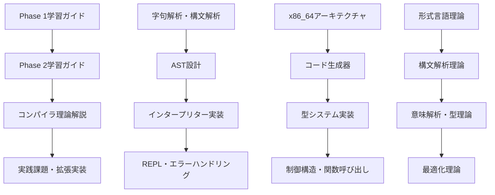

# pugプロジェクト 段階的学習ガイド

**📚 コンパイラ技術を段階的に学ぶための包括的ドキュメント**

このディレクトリには、pugプロジェクトで段階的にコンパイラ技術を学ぶための詳細なガイドが含まれています。

## 📖 学習ガイド一覧

### 🎯 段階別チュートリアル

| ガイド | 内容 | 対象レベル | 推定学習時間 |
|--------|------|-----------|-------------|
| **[Phase 1学習ガイド](phase1_tutorial.md)** | 字句解析・構文解析・AST・インタープリター | 初級 | 20-30時間 |
| **[Phase 2学習ガイド](phase2_tutorial.md)** | コンパイラ理論・アセンブリ生成・型システム | 中級 | 30-40時間 |
| **[コンパイラ理論解説](compiler_theory.md)** | 形式言語理論・最適化理論・型理論 | 上級 | 40-50時間 |

### 🏗️ 推奨学習順序



## 🎯 各フェーズの学習目標

### Phase 1：基本言語処理システム
- [x] **字句解析器（Lexer）** - 正規表現と有限オートマトン
- [x] **構文解析器（Parser）** - 文脈自由文法とPratt Parser
- [x] **抽象構文木（AST）** - プログラム構造の内部表現
- [x] **インタープリター（Evaluator）** - AST直接実行とオブジェクトシステム

### Phase 2：コンパイラ基盤
- [x] **x86_64アーキテクチャ** - レジスタ・命令セット・呼び出し規約
- [x] **コード生成器** - ASTからアセンブリコードへの変換
- [x] **型システム** - 静的型検査とエラー検出
- [x] **制御構造** - if文・while文・関数呼び出しの実装

### コンパイラ理論：理論的基盤
- [x] **形式言語理論** - チョムスキー階層と言語クラス
- [x] **字句・構文解析理論** - オートマトン理論と構文解析法
- [x] **意味解析理論** - 型理論と記号表管理
- [x] **最適化理論** - データフロー解析と制御フロー解析

## 🔧 実践的な学習アプローチ

### 1. 理論と実践の組み合わせ
- 各章で理論的背景を学習
- 実際のコード実装で理解を深化
- 実践課題で応用力を養成

### 2. 段階的な複雑性
- シンプルな概念から開始
- 徐々に高度な技術を導入
- 各段階で確実な理解を確保

### 3. 実用的なプロジェクト
- 動作するコンパイラを段階的に構築
- 性能測定による定量的改善確認
- 産業標準との比較分析

## 📊 学習成果の測定

### 性能目標
```
Phase 1 インタープリター: ベースライン性能
Phase 2 基本コンパイラ:   10倍高速化
Phase 3 最適化コンパイラ: 50倍高速化  
Phase 4 LLVM連携:        100倍高速化
```

### 理解度チェックポイント
- [ ] 各フェーズの理論的背景を説明できる
- [ ] 実装の設計判断の理由を説明できる
- [ ] 性能改善の原理を定量的に分析できる
- [ ] 他の言語処理系との比較ができる

## 🎓 学習の進め方

### 準備
1. **Go言語の基礎知識**（関数・構造体・インターフェース）
2. **コンピュータアーキテクチャの基礎**（レジスタ・メモリ・スタック）
3. **アルゴリズムとデータ構造**（再帰・木構造・グラフ）

### 学習環境
- **開発環境**: Go 1.19以上、make、アセンブラ（as）、リンカ（ld）
- **参考書籍**: ドラゴンブック、Go言語でつくるインタープリター
- **オンラインリソース**: Stanford CS143、MIT 6.035

### 学習記録
各ガイドには以下が含まれています：
- **学習日記テンプレート** - 進捗記録用
- **理解度チェック質問** - 自己評価用
- **実践課題** - スキル定着用
- **拡張アイデア** - 発展学習用

## 🔗 関連リソース

### プロジェクト内リソース
- **[メインREADME](../README.md)** - プロジェクト全体概要
- **[examples/](../examples/)** - サンプルプログラム集
- **[benchmark/](../benchmark/)** - 性能測定システム

### 外部学習リソース
- **[Stanford CS143 Compilers](https://web.stanford.edu/class/cs143/)**
- **[MIT 6.035 Computer Language Engineering](https://ocw.mit.edu/courses/electrical-engineering-and-computer-science/6-035-computer-language-engineering-sml-2005/)**
- **[LLVM Documentation](https://llvm.org/docs/)**

---

**🚀 学習の成功を祈ります！**

段階的に学習を進めることで、確実にコンパイラ技術を習得できます。理論と実践の両面から理解を深め、産業レベルのコンパイラ実装スキルを身につけましょう！

**質問や提案がある場合は、GitHubのIssuesでお気軽にお聞かせください。**